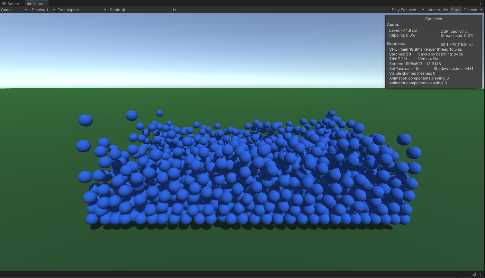
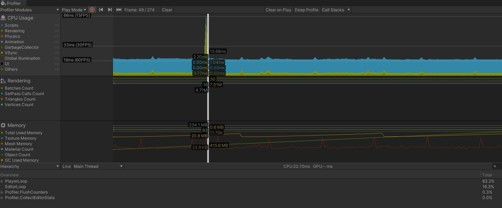

# MyFluidSimulation

**Overview**

MyFluidSimulation is a small Unity project demonstrating a particle-based fluid simulation. It includes particle management, simple physics interactions, and visualizations suitable for learning and experimentation.

**Features**

- **Real-time particle simulation:** Efficient particle updates and rendering.
- **Modular scripts:** Core logic lives in `Assets/Scripts/ParticleManager.cs` and related scripts.
- **Configurable parameters:** Tweak particle count, forces, and rendering options in the Unity Inspector.

**Requirements**

- Unity 2020.3 LTS or newer (recommended). Adjust if you use a different version.
- Strong CPU recommended for larger particle counts.

**Quick Start**

1. Clone the repository:

```bash
git clone https://github.com/your-username/MyFluidSimulation.git
cd MyFluidSimulation
```

2. Open the project in Unity Hub and select the cloned folder.
3. Open the `SampleScene` (or the scene in `Assets/Scenes`) and press Play.

**Running & Controls**

- Use the Unity Editor Play button to run the simulation.
- Adjust particle parameters on the `ParticleManager` component in the Inspector.

**Media (Videos & Screenshots)**

Video demos and screenshots are intentionally left as placeholders — replace the URLs and images with your final assets.

Video links:

- Demo 1: https://www.youtube.com/watch?v=3zXecs_evS4
- Demo 2: https://www.youtube.com/watch?v=LfoeKTEu-JQ

Screenshots (place image files in `Assets/ReadmeImages/` and keep names as below):




**Project Structure (important files)**

- `Assets/Scripts/ParticleManager.cs` — core particle simulation and manager.
- `Assets/Scenes/` — scenes to run/demo the simulation.

**Configuration Tips**

- Start with a low particle count to test performance, then increase while profiling.
- Use the Inspector sliders on `ParticleManager` to adjust viscosity, particle size, and forces.


